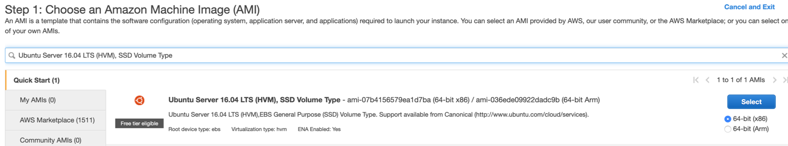

# AWS bastion host overview

Below are instructions for using the AWS CLI to provison an ubuntu virtual machine on AWS. This bastion host will then be used to run the scripts to provision the cluster and application setup.

# Create bastion host

You make the bastion host from the console and then continue with the steps to connect using ssh.  

## 1. Create new EC2 instance. 

You must use this image as to have the install scripts be compatible.
* Ubuntu Server 16.04 LTS (HVM), SSD Volume Type




## 2. Choose Instance Type 

Pick type = t2.micro

## 3. Configure Instance Details

Leave all the defaults.  Optional pick or create a different subnet

## 4. Add Storage

Leave all the defaults.  

## 5. Add Names

Add a tag Key = Name.  Value = dt-kube-demo-bastion

## 6. Configure Security Group

Update SSH for TCP 22 to be Source = 'My IP'.  You can pick 'Anywhere' but you will get warning.

## 7. Launch

You will be asked to pick or create the AWS ssh key.  Be sure you have this downloaded locally. 

## 8. Proceed to 'Connect and Prepare to bastion host' section below

# Provision bastion host using CLI

These instructions assume you have an AWS account and have the AWS CLI installed and configured locally.

These commands work on Mac and Linux.  You will need to adjust for running on Windows.

See [AWS documentation](https://docs.aws.amazon.com/cli/latest/userguide/cli-chap-welcome.html) for local CLI installation and configuration.

## 1. Run CLI to provision resources

On your laptop, run these commands to create the bastion host with security group that allows ssh access

```
# adjust these variables
export SSH_KEY=<your ssh aws key name>
export CLUSTER_REGION=<example us-west-2>
export RESOURCE_PREFIX=<example your last name>
# NOTE: The AMI ID may vary my region. This is the AMI for us-west-2 
export AMI_ID=ami-08692d171e3cf02d6

# leave these values as they are
export AWS_HOST_NAME="$RESOURCE_PREFIX"-dt-kube-demo-bastion
export AWS_SECURITY_GROUP_NAME="$RESOURCE_PREFIX"-dt-kube-demo-bastion-group

# create-security-group
aws ec2 create-security-group \
  --group-name $AWS_SECURITY_GROUP_NAME \
  --description "Used by dt-kube-demo bastion host"

# get the new security-group id
export AWS_SECURITY_GROUP_ID=$(aws ec2 describe-security-groups \
  --filters "Name=group-name,Values=$AWS_SECURITY_GROUP_NAME" \
  --query "SecurityGroups[0].GroupId" \
  --output text)

# update create-security-group with inbound rule
aws ec2 authorize-security-group-ingress \
  --group-id "$AWS_SECURITY_GROUP_ID" \
  --protocol tcp \
  --port 22 \
  --cidr "0.0.0.0/0"

# provision the host
aws ec2 run-instances \
  --image-id "$AMI_ID" \
  --count 1 \
  --security-group-ids "$AWS_SECURITY_GROUP_ID" \
  --instance-type t2.micro \
  --key-name $SSH_KEY  \
  --associate-public-ip-address \
  --tag-specifications "ResourceType=instance,Tags=[{Key=Name,Value=$AWS_HOST_NAME}]" \
  --region $CLUSTER_REGION
```

## 2. Proceed to 'Connect and Prepare to bastion host' section below

# Connect and Prepare to bastion host 

## 1. SSH to the bastion host 

From the aws web console, get the SSH command to connect to the bastion host. For example:
```
ssh -i "<your pem file>.pem" ubuntu@<your host>.compute.amazonaws.com
```

REFERENCE: [aws docs](https://docs.aws.amazon.com/AWSEC2/latest/UserGuide/AccessingInstances.html?icmpid=docs_ec2_console)

## 2. Initialize aws CLI on the bastion

Within the bastion host, run these commands to install the aws CLI 
```
sudo apt update
sudo apt install awscli --yes
```

Run this command to configure the cli 
```
aws configure
```

At the prompt, 
* enter your AWS Access Key ID
* enter your AWS Secret Access Key ID
* enter Default region name example us-east-1
* enter Default output format, enter json

See [this article](https://aws.amazon.com/blogs/security/wheres-my-secret-access-key/) for For help access keys

When complete, run this command ```aws ec2 describe-instances``` to see your VMs

## 3. Clone the Orders setup repo

Within the VM, run these commands to clone the setup repo.

```
git clone https://github.com/dt-kube-demo/setup-infra.git
cd setup-infra
```
## 4. Proceed to the [Provision Cluster and onboard the Orders application](README.md#bastion-host-setup) step.

# Delete the bastion host

## Option 1 - delete using azure cli

From your laptop, run these commands to delete the EC2 instance 

```
# adjust these variables
export SSH_KEY=<your ssh aws key name>
export CLUSTER_REGION=<example us-west-2>
export RESOURCE_PREFIX=<example your last name>

# leave these values
export AWS_HOST_NAME="$RESOURCE_PREFIX"-dt-kube-demo-bastion
export AWS_SECURITY_GROUP_NAME="$RESOURCE_PREFIX"-dt-kube-demo-bastion-group

# get bastion host instance id
export AWS_INSTANCE_ID=$(aws ec2 describe-instances \
  --filters "Name=tag:Name,Values=$AWS_HOST_NAME" "Name=instance-state-name,Values=running" \
  --query "Reservations[0].Instances[0].InstanceId" \
  --output text)
# terminate instance
aws ec2 terminate-instances --instance-ids $AWS_INSTANCE_ID

# get the security-group id
export AWS_SECURITY_GROUP_ID=$(aws ec2 describe-security-groups \
  --filters "Name=group-name,Values=$AWS_SECURITY_GROUP_NAME" \
  --query "SecurityGroups[0].GroupId" \
  --output text)

# delete the security group
aws ec2 delete-security-group --group-id $AWS_SECURITY_GROUP_ID
```

## Option 2 - delete from the Azure console

The the aws web console, choose VM and terminate it.

